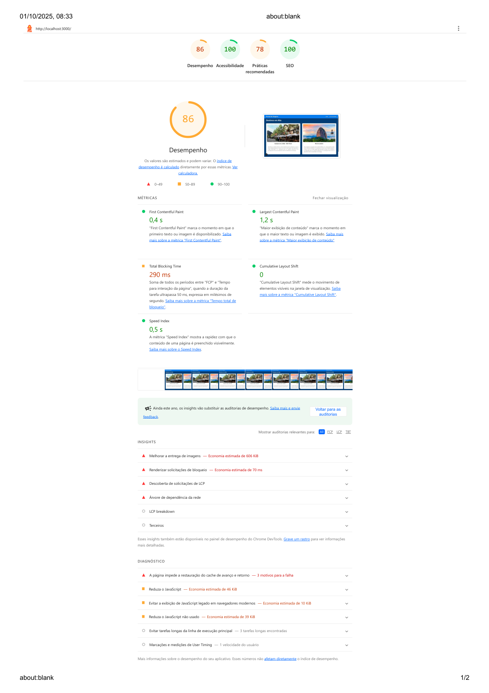
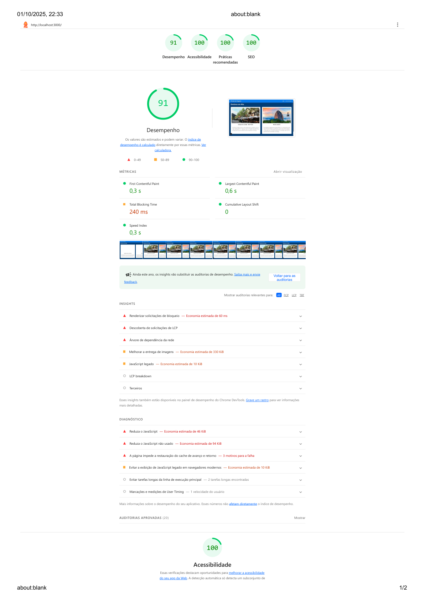

# Portal Viagens — Performance & Boas Práticas

Este repositório contém um portal de destinos de viagem com foco em **UI responsiva**, **acessibilidade** e **performance web**.
O objetivo deste ciclo foi **identificar gargalos**, **aplicar melhorias** e **medir o ganho** com auditorias Lighthouse.

---

## 📌 Visão geral

- **Stack**: Next.js + React + TypeScript + Styled Components.
- **Foco**: Core Web Vitals, boas práticas de segurança e SEO on-page.
- **Como medir**: Chrome DevTools → Lighthouse (Desktop).

---

## 🔎 Gargalos identificados

1. **Entrega de imagens** ineficiente (oportunidade de ~600 KiB): ausência de formatos modernos/responsivos e atributos `width/height`/`loading`.
2. **JavaScript acima do necessário**: bundles com código não utilizado (estimado ~39–94 KiB) e uso de JS legado.
3. **Tarefas longas na main thread**: picos ocasionais afetando o TBT.
4. **Best Practices baixas**: dependências de cookies de terceiros vindo da API do melhores destinos.
---

## ✅ Melhorias aplicadas

- **Imagens**
  - Conversão para **WebP/AVIF** e versões **responsivas** (`NextImage`/`sizes`) com `width`/`height`.
- **JavaScript**
  - **Remoção de código não usado** e **minificação**.
- **Boas práticas e segurança**
  - Remoção/substituição de **cookies de terceiros** quando possível.
- **Outros**
  - Revisão de imports que não são usados.

---

## 📈 Comparativo antes/depois

Imagens (prints) das auditorias Lighthouse:

- **Antes** (01/10/2025 – manhã):
  `docs/print-lighthouse-inicial.png`
- **Depois** (01/10/2025 – noite):
  `docs/print-lighthouse-final.png`

### Prints

### Métricas (Desktop)

| Métrica                          | Antes | Depois | Comentário |
|----------------------------------|:-----:|:------:|------------|
| **Performance (score)**          |  86   |  **91** | Ganho decorrente de otimização de imagens e JS. |
| **FCP (First Contentful Paint)** | 0,4 s | **0,3 s** | Menos bloqueio na renderização inicial. |
| **LCP (Largest Contentful Paint)** | 1,2 s | **0,6 s** | Grande impacto da troca/otimização do herói e preload. |
| **TBT (Total Blocking Time)**    | 290 ms | **240 ms** | Redução de tarefas longas e carga adiada. |
| **Speed Index**                  | 0,5 s | **0,3 s** | Conteúdo visível mais rápido. |
| **CLS (Layout Shift)**           | 0     | 0      | Estável (uso de dimensões e reserva de espaço). |
| **Acessibilidade**               | 100   | 100    | Mantido excelente. |
| **Best Practices**               |  78   | **100** | Endurecimento de segurança + remoção de cookies de terceiros. |
| **SEO**                          | 100   | 100    | Mantido excelente. |

---

## 💬 Comentários

- **Maior ganho** veio de **imagens** (formatos modernos, `NextImage/sizes` e `width/height`) + **Pré-carregamento do LCP** e **adiamento de JS**.
- **Best Practices 100** após eliminação de dependências problemáticas.
---

## ▶️ Como reproduzir o teste

1. Build/servidor de produção (ex.: `npm run build`).
2. Chrome → **DevTools** → **Lighthouse** → **Desktop** → rodar auditoria com throttling padrão.
3. Compare os relatórios com os prints acima.

---